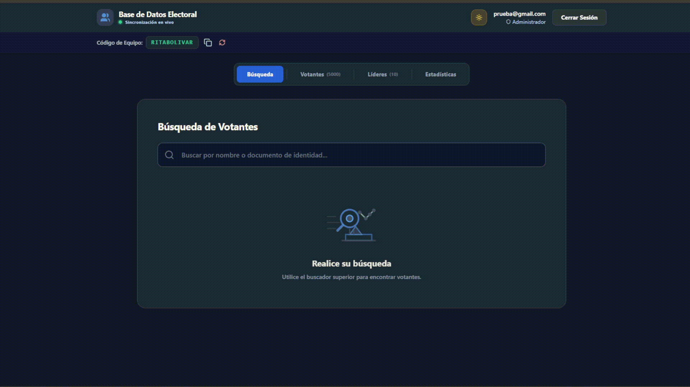

# Base Electoral SaaS

> Sistema SaaS multiusuario diseñado para gestionar votantes a gran escala, optimizando el rendimiento mediante procesamiento en servidor.

[Demo en vivo](https://base-electoral.vercel.app/) | [Repositorio](https://github.com/EstebanDMR/base-electoral)

---

## Resumen del Proyecto

* Sistema SaaS multiusuario para gestión de votantes y equipos.
* Optimizado para manejar miles de registros sin degradación.
* Implementa paginación por cursores y consultas en servidor.
* Arquitectura desacoplada (DAL + lógica de negocio + UI).

---

## Demo



---

## El Origen del Proyecto

El desarrollo comenzó como una solución rápida para organizar la base de un equipo electoral. La primera versión cumplió su cometido de manera básica: descargaba todos los datos de Firebase en una sola petición al iniciar la aplicación, y React manejaba localmente los filtros y la paginación.

Esto funcionaba a una escala muy pequeña, pero al superar los 1000 registros, la falta de una arquitectura de datos evidenció sus fallas:

* Lentitud extrema en la carga inicial.
* Congelamientos en la UI al interactuar.
* Consumo innecesario de memoria en los dispositivos de los usuarios.

> Este punto marcó la transición de una solución funcional a un sistema diseñado para escalar.

---

## El Problema: El Cuello de Botella en el Cliente

Delegar el procesamiento de grandes volúmenes de datos al cliente deja de ser viable rápidamente a medida que crecen los registros. Al descargar miles de nodos en bloque:

* Se congestionaba el *Main Thread* del navegador
* El tiempo de carga inicial (TTV) aumentaba significativamente
* Se transferían datos innecesarios al cliente

Esto no solo afectaba la experiencia de usuario, sino también el consumo de recursos de red y costos operativos.

---

## La Solución y Evolución Técnica

Al identificar el límite, el sistema fue refactorizado para delegar el procesamiento al servidor.

Se aplicaron los siguientes cambios clave:

* **Peticiones iterativas (`limitToFirst`)**
  Solo se descargan los datos visibles en pantalla.

* **Paginación por cursores (`startAt`)**
  Permite navegar eficientemente grandes volúmenes de datos sin depender de offsets.

  > Nota: Se implementa control de duplicados en cliente debido a limitaciones del cursor en Realtime Database.

* **Debounce en búsquedas**
  Se evita ejecutar múltiples consultas por cada tecla, esperando a que el usuario termine de escribir.

* **Normalización de datos (`nombre_normalizado`)**
  Se eliminan tildes y mayúsculas para permitir indexación eficiente en Firebase.

---

## Arquitectura Estructural

Se implementó una separación clara de responsabilidades para mejorar mantenibilidad y escalabilidad:

```text
├── src/
│   ├── services/  # Data Access Layer (DAL)
│   ├── hooks/     # Lógica de negocio
│   ├── views/     # UI (presentación)
│   └── utils/     # Funciones reutilizables
```

Esta estructura permite escalar, testear y reemplazar tecnologías sin afectar la lógica principal.

---

## Decisiones Técnicas Clave

* **Desacoplamiento de servicios (DAL)**
  La lógica de acceso a datos se separa completamente de la UI.

* **Paginación por cursor vs offset**
  Mejora el rendimiento y evita sobrecarga en memoria.

* **Normalización de datos en NoSQL**
  Permite búsquedas eficientes en una base con limitaciones de consulta.

---

## Impacto en Performance

| Métrica Crítica         | v1.0 (Client-Side) | v2.0 (Server Query) |
| ----------------------- | ------------------ | ------------------- |
| **Carga Inicial (TTV)** | > 4s               | < 0.5s              |
| **Búsqueda**            | Bloqueos en UI     | Fluida con debounce |
| **Uso de memoria**      | Alto               | Optimizado          |

---

## Trade-offs Operativos

* **Realtime Database vs Firestore**
  Se priorizó Realtime DB por su bajo costo y velocidad en tiempo real, sacrificando capacidades avanzadas de consulta.

* **Búsqueda por prefijo**
  Solo permite búsquedas tipo "empieza por", en lugar de búsquedas completas tipo motor (ej. Elasticsearch).

---

## Seguridad

* Autenticación con Firebase Authentication
* Control de acceso por roles
* Reglas de seguridad en base de datos para proteger lecturas y escrituras

---

## Próximas Implementaciones

* Enrutamiento protegido con middleware (React Router)
* Soporte offline (Service Workers)

---

## ¿Qué demuestra este proyecto?

* Diseño de sistemas escalables en frontend
* Optimización de rendimiento con grandes volúmenes de datos
* Separación de responsabilidades (DAL, lógica, UI)
* Toma de decisiones técnicas con trade-offs reales
* Capacidad de refactorizar una solución funcional hacia una arquitectura robusta

---

## Autor

**EstebanDMR** | Full Stack Developer
